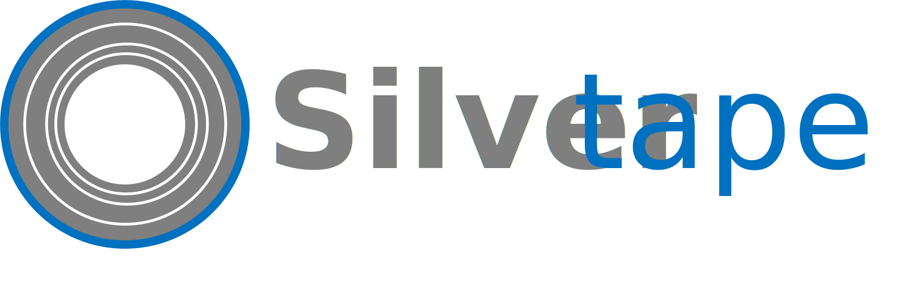

A blockchain platform replacing:

- privatekeys cryptography by DIDs (Decentralized IDs - so you don't need to make law-infringing cryptography worrying theoretical existing quantum computers)
- loss of privatekeys by Social Recovery
- Solidity by Solidity + Linux programming languages such as Python and Bash (code auditing needed more than ever)
- blob sharding by full sharding
- data purging by data deduplicing
- hack rekt by hack recovery through instant hardforks

To learn more, read the .txt files in this repository (there are also JPG drawings - that aren't NFTs, BTW)
